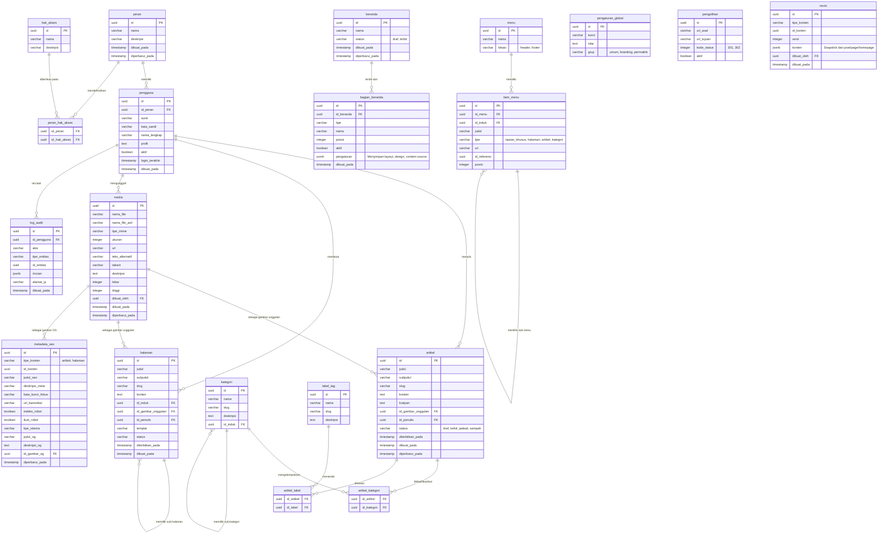

# Entity Relationship Diagram (ERD) - CMS Arsitektur
Dibuat berdasarkan struktur CMS spesifikasi tingkat tinggi (React, Node.js, PostgreSQL).
Sesuai dengan ketentuan, seluruh nama tabel dan kolom menggunakan penamaan Bahasa Indonesia.

## 1. Diagram ERD (Mermaid)

## 2. Rasionalisasi Desain Database Berdasarkan PRD

Desain tabel dan relasi di atas dirancang secara spesifik untuk menjawab kebutuhan sistem berdasarkan dokumen panduan awal:

### A. Fleksibilitas Struktur (JSONB pada `bagian_beranda`)
Tabel `bagian_beranda` (*homepage_sections*) menggunakan kolom tipe `jsonb` bernama `pengaturan`. Ini krusial karena PRD Bab 18 & 43 menuntut Homepage Builder untuk menyimpan `Content`, `Design`, `Layout`, dan `Advanced Settings` yang bentuk/skemanya sangat bervariasi bergantung pada tipe seksi (misal: hero vs grid konten). Jika menggunakan kolom relasional biasa, tabel akan mengalami pembengkakan (kolom kosong/null yang masif).

### B. Pemisahan Total Data CMS (Polymorphism)
PRD Bab 25, 41, dan 61 menekankan pemisahan *Content* dan *Configuration*. Oleh sebab itu:
- **`metadata_seo`** dipisah dan dirancang *polymorphic* (`tipe_konten` & `id_konten`). Hal ini mencegah pelebaran struktur (bloating) pada tabel utama `artikel` maupun `halaman`, sekaligus memperlancar logika React saat hanya membutuhkan data publik.
- **`revisi`** juga menggunakan pola *polymorphic*. Dengan menyimpan format snapshot JSON di kolom `konten`, sistem bisa me-restore tidak hanya artikel/halaman, tapi juga arsitektur visual Beranda (PRD Bab 32 & 36).

### C. Efisiensi File Objek (Tabel `media`)
Diselaraskan dengan arahan Bab 7 dan Bab 15, PostgreSQL murni berperan sebagai *metadata registry* untuk media. Binary file ditaruh di *Object Storage*. Semua tabel konten (`artikel`, `halaman`, `metadata_seo`) hanya menyimpan *Foreign Key* ke tabel `media` guna mempertahankan konsistensi referensial untuk Alt text dan Caption tanpa redundansi text string berulang di database.

### D. Hierarki & Taksonomi Berjenjang
Bab 13 dan Bab 29 menitikberatkan pada Parent-Child relationship. Skema relasional yang dipakai adalah *Self-Referencing Foreign Keys* pada:
- `kategori` (`id_induk` mengarah ke `id` kategori).
- `halaman` (`id_induk` mengarah ke `id` halaman pembentuk parent/child URL struktur hirarki page).
- `item_menu` memungkinkan infinite nesting untuk navigasi dropdown multi-level.

### E. RBAC (Role-Based Access Control) Murni
Sistem akses tidak "hard-coded" pada entitas tabel *pengguna*, melainkan dijembatani melalui `peran` dan tabel junction `peran_hak_akses`. Ini memenuhi requirement Bab 9.3 (Permission Examples), sehingga admin bisa secara dinamis mencabut/memberi izin seperti `posts.delete` tanpa merombak sistem atau source code backend.
